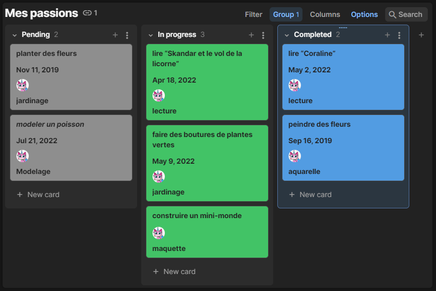
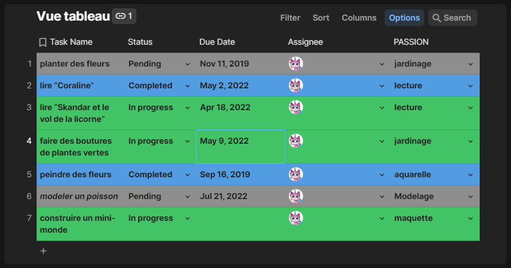
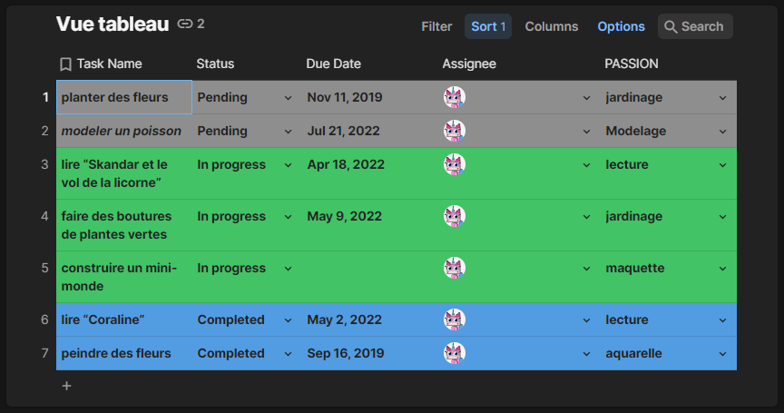
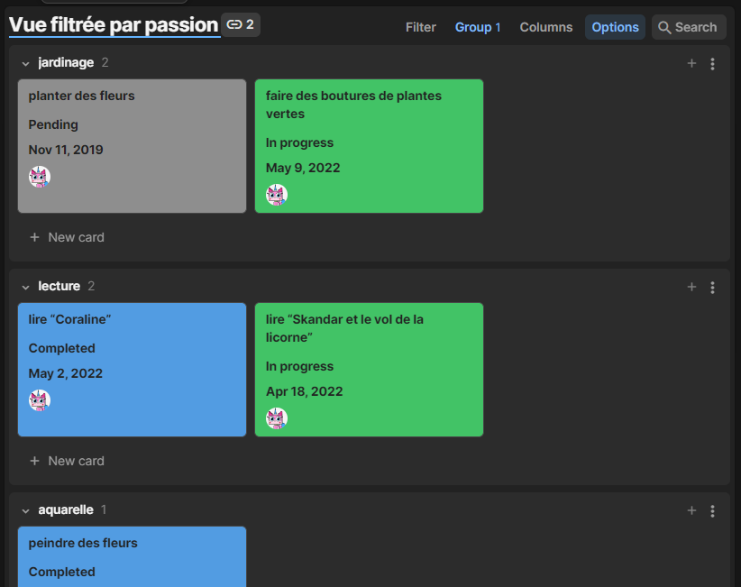
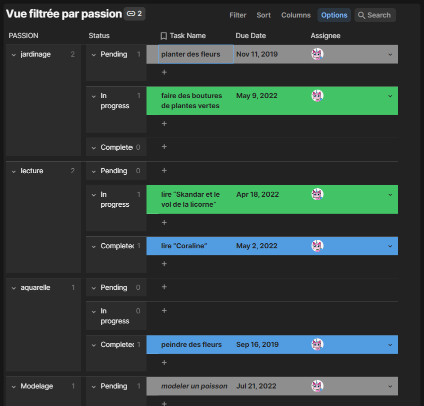

# Passionnément

## :dart: Le but de cet atelier

Nous voudrions nous connaitre un peu mieux, les uns et les autres. Pourquoi ne pas échanger au sujet de nos passions ?

Ce sera pour nous l'occasion d'utiliser **Coda** pour débuter une réflexion sur ce contenu à structurer. Dans un second temps, nous insérerons ce contenu dans du HTML.

## :arrow_forward: étape 1 : Lister vos passions sur Coda.io

1. Dans votre espace de travail **Coda**, vous allez créer une liste de taches *(New Template : Tasks kanban)*
2. En mode *Tasks kanban*, vous avez 3 colonnes : *Completed*, *In progress*, *Pending*. Ces trois colonnes vont vous servir à trier les projets que vous avez déjà accompli, ceux qui sont en cours, et ceux que vous projetez de réaliser.
3. Vous pouvez ajouter un premier projet dans l'une de ces colonnes.
4. A ce projet, vous pouvez attribuer une nouvelle propriété (ou colonne) : **passion**
5. Pour la propriété **passion**, nous devrons associer une valeur. Cette valeur sera le nom de la passion. Par exemple, pour le projet *peindre un bouquet de fleurs*, la valeur de la propriété *passion* sera **aquarelle**.

Voici un exemple de ce qui est attendu :



---

## :arrow_forward: étape 2 : Créer de nouvelles vues

### 1. D'abord, créez une vue de type **table**.



### 2. Triez cette vue par **status**.



## :arrow_forward: étape 3 : Préparer l'espace de travail

Maintenant, vous allez utiliser le travail fait au préalable sur Coda.

1. Clonez ce dépot sur votre machine.

   Voici comment s'y prendre :
   ```sh
   git clone adresse-ssh-de-votre-depot-github
   ```
   :information_desk_person: remplacez bien `adresse-ssh-de-votre-depot-github` par l'adresse SSH de votre dépot Github.
   ***
2. Créez un fichier `index.html` dans le répertoire du dépot que vous venez de cloner.

   Ce fichier servira de __point d'entrée__ de notre projet. Ce sera notre *page principale* où seront listées les liens vers nos différentes fiches de nos projet passion.
   ***
3. Créez un fichier HTML pour chacun de vos projets. Chaque fichier HTML devra avoir un nom unique en caractères minuscules, et se terminera par l'extension `.html`.

   > Par exemple : Le projet *modeler un poisson* sera décrit dans le fichier `modeler-un-poisson.html`
   ***
4. Créez autant de dossiers que vous avez de passions différentes. Pour nommer ces dossiers, utilisez les mêmes contraintes que pour les fichiers markdown.

   > Par exemple : La passion *lecture* aura son propre dossier nommé `lecture`.
   ***
5. Déplacez les fichiers HTML des projets dans leur *dossier passion"* respectifs.

   > `index.html` doit rester en dehors des *dossiers passion*. Il doit rester __à la racine__.
***

## :two: étape 4 : Décrivez vos projets
***

Vous pouvez à présent rédiger vos différents projets. Si vous voulez vous exercer au HTML, vous pouvez, sinon utilisez pour le moment le markdown que vous connaissez pour structurer le texte de vos projets.

Voici quelques recommandations pour bien mettre en forme vos fichiers :

* Mettez bien les balises minimales nécessaires pour formater correctement votre document HTML dans chacun des fichiers.
* Structurez votre contenu avec des titres de différents niveaux
* Mettez l'accent sur certains mots dans votre texte quand nécessaire
* Ajoutez une illustration ou une photo
* Notez un lien, vers un site qui vous a inspiré, par exemple

***

## Bonus

Dans Coda, créez une vue de type **card**. Cette fois, au lieu de grouper les projets par leur **status** (*Completed* ,*In progress*, *Pending*), nous allons les grouper par **passion**.



Ajoutez un second regroupement par **status**.


